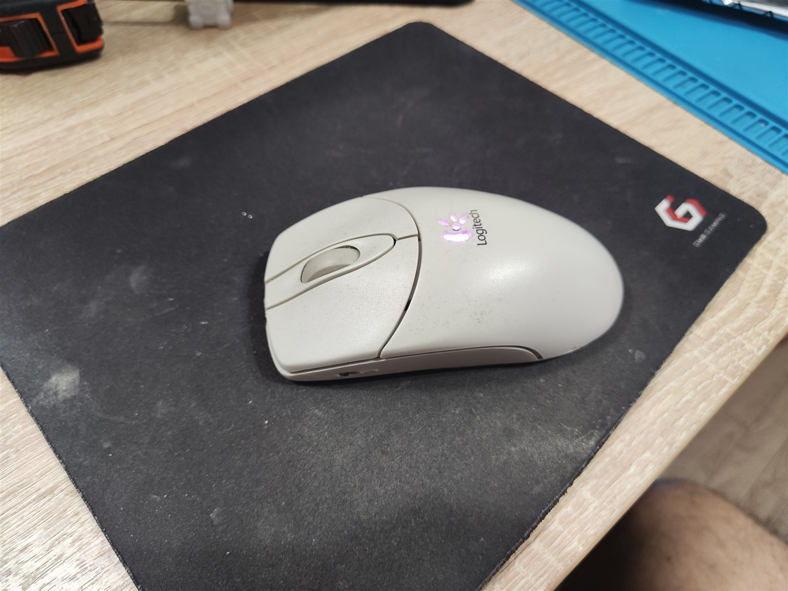
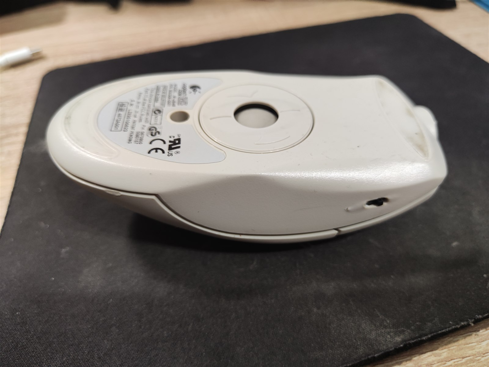
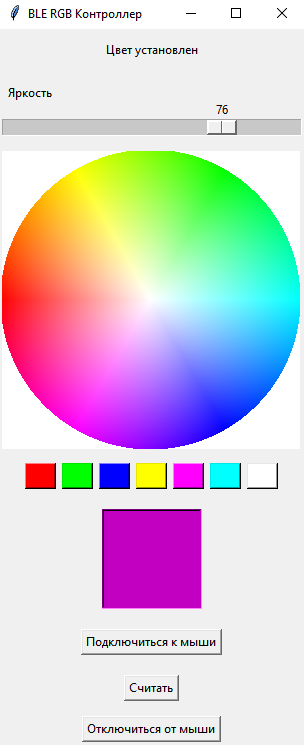

# Беспроводная шариковая BLE-мышь

Ретрофутуристичный проект: обычная проводная шариковая мышь переделана в автономную беспроводную. Внутри корпуса размещены ESP32, аккумулятор и модуль зарядки, а штатный кабель заменён разъёмом питания.

*Готовое устройство без штатного кабеля, с RGB-индикацией в логотипе.*

*Вместо штатного кабеля в передней части корпуса установлен разъём зарядки.*

*Компоненты после укладки внутри корпуса: штатная плата шариковой мыши, ESP32, аккумулятор и модуль зарядки.*

*Устройство в разобранном виде с расправленными проводами — видны исходная электроника мыши, ESP32, аккумулятор, модуль зарядки и их соединения.*

*Настольная утилита позволяет подключаться к мыши и изменять цвет и яркость подсветки.*

## Видеодемонстрация

[▶ Смотреть видеодемонстрацию BLE-мыши на Яндекс Диске](https://disk.yandex.ru/d/QwfGqAyneemogQ)

## Как это работает

ESP32 считывает стандартные USB HID-отчёты исходной мыши и передаёт перемещение, прокрутку и нажатия кнопок компьютеру как BLE HID-устройство. Благодаря этому механика и электроника самой шариковой мыши используются без изменения их внутреннего протокола.

## Что реализовано

- преобразование USB HID Mouse в BLE HID Mouse;
- передача перемещения, колеса прокрутки и трёх кнопок;
- повторное подключение и перезапуск BLE-рекламы после потери связи;
- контроль напряжения аккумулятора через ADC и передача уровня заряда по BLE;
- адресная RGB-подсветка с индикацией этапов запуска и состояния соединения;
- отдельный BLE-сервис для настройки цвета и яркости подсветки;
- сохранение настроек подсветки в энергонезависимой памяти ESP32;
- настольная Python-утилита для управления подсветкой.

## Структура проекта

- `mouse/mouse.ino` — основная логика USB Host и BLE HID;
- `mouse/LedControl.*` — RGB-подсветка, BLE-характеристики и сохранение настроек;
- `mouse/BatteryMonitor.h` — измерение и расчёт уровня заряда;
- `py_mouse_gue/ble_gui.py` — настольный интерфейс управления подсветкой.

## Границы проекта

Прошивка и Python-утилита разрабатывались с активным использованием ИИ и готовых библиотек USB Host и BLE Mouse. Проект демонстрирует интеграцию программных и аппаратных компонентов и создание законченного устройства, но не является собственной реализацией BLE- или USB-стека.

## Технологии

`ESP32` · `Arduino` · `C++` · `USB Host` · `USB HID` · `BLE HID` · `ADC` · `NeoPixel` · `Python`
